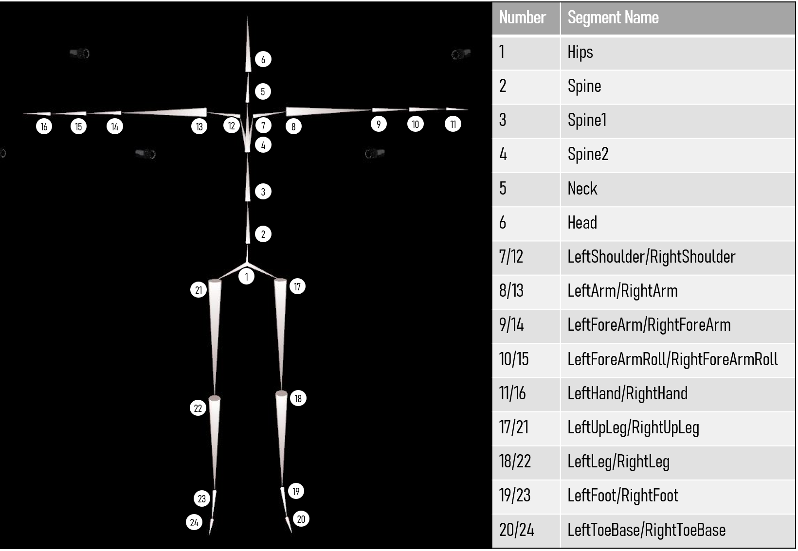

# Segment names

## Upper body

| Left         | Unilateral | Right         |
| :----------- | :--------- | :------------ |
|              | Head       |               |
|              | Neck       |               |
| LeftShoulder |            | RightShoulder |
| LeftArm      |            | RightArm      |
| LeftForeArm  |            | RightForeArm  |
| LeftHand     |            | RightHand     |
|              | Spine2     |               |
|              | Spine1     |               |
|              | Spine      |               |

## Lower body

| Left        | Unilateral | Right        |
| :---------- | :--------- | :----------- |
|             | Hips       |              |
| LeftUpLeg   |            | RightUpLeg   |
| LeftLeg     |            | RightLeg     |
| LeftFoot    |            | RightFoot    |
| LeftToeBase |            | RightToeBase |
