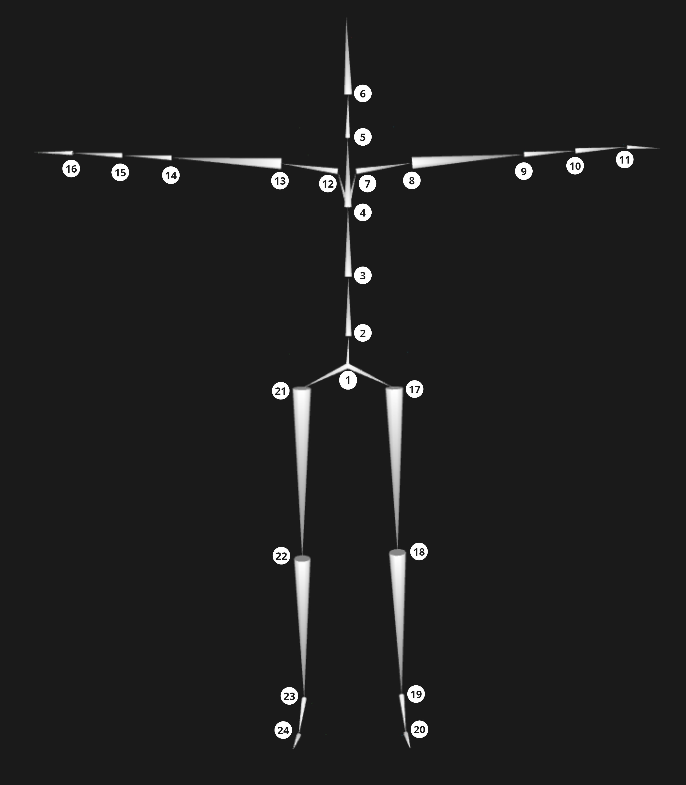

# Segment and joint names

## Skeleton description

| Number       | Segment                          | Proximal Joint                                          | Distal Joint |
| :----------- | :---------                       | :------------                                           | :------------  | 
| 1            | Hips                             | Null                                                    | Null |
| 2            | Spine                            | HipsSpine                                               | SpineSpine1 |
| 3            | Spine1                           | SpineSpine1                                             | SpineSpine2 |
| 4            | Spine2                           | Spine1Spine2                                            | Spine2Neck |
| 5            | Neck                             | Spine2Neck                                              | NeckHead |
| 6            | Head                             | NeckHead                                                | External* |
| 7/12         | LeftShoulder/RightShoulder       | LeftSternoclavicular/RightSternoclavicular              | LeftGlenohumeral/RightGlenohumeral |
| 8/13         | LeftArm/RightArm                 | LeftGlenohumeral/RightGlenohumeral                      | LeftElbow/RightElbow |
| 9/14         | LeftForeArm/RightForeArm         | LeftElbow/RightElbow                                    | LeftForeArmLeftForeArmRoll/RightForeArmRightForeArmRoll |
| 10/15        | LeftForeArmRoll/RightForeArmRoll | LeftForeArmLeftForeArmRoll/RightForeArmRightForeArmRoll | LeftWrist/RightWrist |
| 11/16        | LeftHand/RightHand               | LeftWrist/RightWrist                                    | External* |
| 17/21        | LeftUpLeg/RightUpLeg             | LeftHip/RightHip                                        | LeftHip/RightHip |
| 18/22        | LeftLeg/RightLeg                 | LeftKnee/RightKnee                                      | LeftKnee/RightKnee |
| 19/23        | LeftFoot/RightFoot**             | LeftAnkle/RightAnkle                                    | LeftAnkle/RightAnkle |
| 20/24        | LeftToeBase/RightToeBase**       | Null                                                    | Null |

\* External is a virtual joint where the external forces and moments will be applied to one or more segment extremities. It is used during the inverse dynamics procedure. For example in gait, this External joint is the center of pressure when the foot is in contact with the force plate.  
\** Note that the LeftFoot/RightFoot is the extremity segment instead of the LeftToeBase/RightToeBase for the lower body. LeftToeBase/RightToeBase has only a visual purpose with no biomechanical meaning.