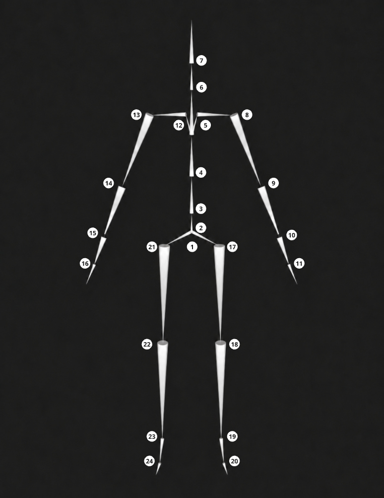
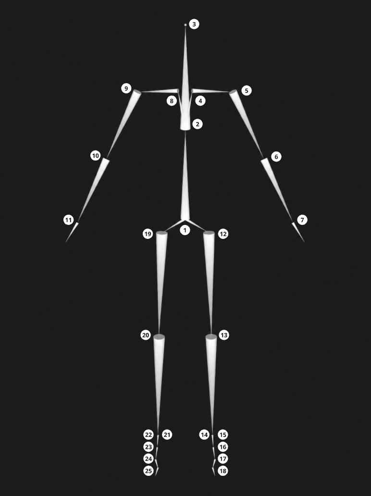

# Segment and joint names
## Skeleton description
Two skeletons definitions, m1 and m2, are supported in Calqulus. The first skeleton definition (m1) is used in our QTM workflows that are using the Sports marker set, Theia3D and Prisma Pose 1.0.0, Qualisys markerless engine. The table below provides a description of this skeleton definition.
  

| Number          | Segment                               | Proximal Joint                                             | Distal Joint |
| :-----------    | :---------                            | :------------                                              | :------------  | 
| 1               | Hips                                  | Null                                                       | Null |
| 2               | Spine                                 | HipsSpine                                                  | SpineSpine1 |
| 3               | Spine1                                | SpineSpine1                                                | SpineSpine2 |
| 4               | Spine2                                | Spine1Spine2                                               | Spine2Neck |
| 5               | Neck                                  | Spine2Neck                                                 | NeckHead |
| 6               | Head                                  | NeckHead                                                   | HeadContact* |
| 7 12         | LeftShoulder RightShoulder         | LeftSternoclavicular RightSternoclavicular              | LeftGlenohumeral RightGlenohumeral |
| 8 13         | LeftArm RightArm                   | LeftGlenohumeral RightGlenohumeral                      | LeftElbow RightElbow |
| 9 14         | LeftForeArm RightForeArm           | LeftElbow RightElbow                                    | LeftForeArmLeftForeArmRoll RightForeArmRightForeArmRoll |
| 10 15        | LeftForeArmRoll RightForeArmRoll   | LeftForeArmLeftForeArmRoll RightForeArmRightForeArmRoll | LeftWrist RightWrist |
| 11 16        | LeftHand RightHand                 | LeftWrist RightWrist                                    | LeftHandContact* RightHandContact* |
| 17 21        | LeftUpLeg RightUpLeg               | LeftHip RightHip                                        | LeftHip RightHip |
| 18 22        | LeftLeg RightLeg                   | LeftKnee RightKnee                                      | LeftKnee RightKnee |
| 19 23        | LeftFoot** RightFoot**             | LeftAnkle RightAnkle                                    | LeftFootContact* RightFootContact* |
| 20 24        | LeftToeBase** RightToeBase**       | Null                                                       | Null |

The second skeleton definition (m2) is used in our workflows using Prisma Pose 2.1.0 or later. The table below provides a description of this skeleton definition.  
 
| Number          | Segment                               | Proximal Joint                                             | Distal Joint |
| :-----------    | :---------                            | :------------                                              | :------------  | 
| 1               | Pelvis                                | Null                                                       | Null |
| 2               | Thorax                                | PelvisThorax                                               | ThoraxCranium |
| 3               | Cranium                               | NeckCranium                                                | CraniumContact* |
| 4 8          | LeftClavicle RightClavicle         | LeftSternoclavicular RightSternoclavicular              | LeftGlenohumeral RightGlenohumeral |
| 5 9          | LeftHumerus RightHumerus           | LeftGlenohumeral RightGlenohumeral                      | LeftElbow RightElbow |
| 6 10         | LeftForearm RightForearm           | LeftElbow RightElbow                                    | LeftWrist RightWrist |
| 7 11         | LeftMetacarpus RightMetacarpus     | LeftWrist RightWrist                                    | LeftMetacarpusContact* RightMetacarpusContact* |
| 12 19        | LeftFemur RightFemur               | LeftHip RightHip                                        | LeftHip RightHip |
| 13 20        | LeftShank RightShank               | LeftKnee RightKnee                                      | LeftKnee RightKnee |
| 14 21        | LeftFoot** RightFoot**             | LeftAnkle RightAnkle                                    | LeftFootContact* RightFootContact* |
| 15 22        | LeftHindfoot** RightHindfoot**     | Null                                                       | Null |
| 16 23        | LeftMidfoot** RightMidfoot**       | Null                                                       | Null |
| 17 24        | LeftForefoot** RightForefoot**     | Null                                                       | Null |
| 18 25        | LeftHallux** RightHallux**         | Null                                                       | Null |

\* These are virtual joints where the external forces and moments will be applied to one or more segment extremities. It is used during the inverse dynamics procedure. For example in gait, this Contact joint is the center of pressure where the foot is in contact with the force plate. It is useful if one wants to access the force plate data such as center of pressure, force and free moment.  
\** Please note that:
- LeftToeBase/RightToeBase have no degree-of-freedom and only a visual purpose with no biomechanical meaning.   
- LeftHindfoot/RightHindfoot, LeftMidfoot/RightMidfoot, LeftForefoot/RightForefoot and LeftHallux/RightHallux are kinematic-only segments. 
